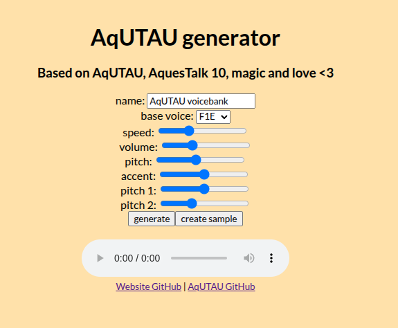

# AqUTAUWeb
AqUTAU-based UTAU voicebank generator in your browser!



For the AquesTalk binaries, see [AQUEST's download page](https://www.a-quest.com/download.html).

## Installation and runnning
Clone this repo.
Then, in `.env`, add the following options:
```bash
DEV_KEY=XXX-YYY-ZZZ
USR_KEY=XXX-YYY-ZZZ
AQ10_PATH=/path/to/aqtk10_lnx/lib64/libAquesTalk10.so.1
PORT=7077
```
Install the dependencies (including AqUTAU) with:
```bash
npm i
```
and then, start the server!
```bash
npm start
```